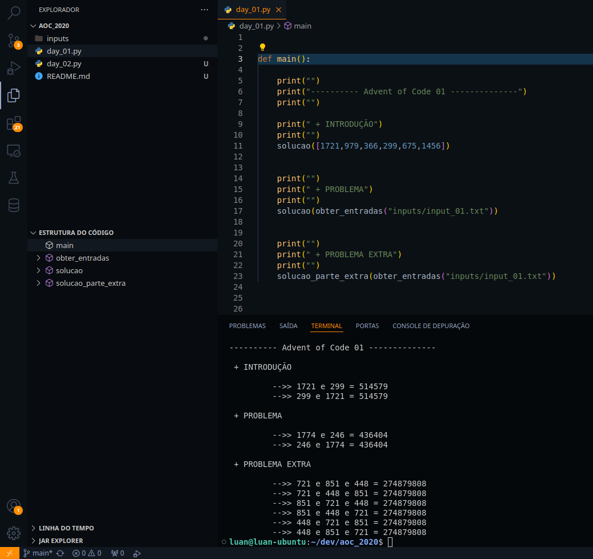

# AOC 2020

## Quem sou eu ?

    Meu nome é Luan Freitas, nasci em 1992 em brasília DF e sou apaixonado por resolução de problemas utilizando algoritmos.

## Motivações

    - Praticar conhecimentos adquiridos nos cursos de python oferecidos na plataforma [Alura](https://www.alura.com.br/)
    - Compreender as funcões builtins apresentadas na [documentação](https://www.python.org/doc/)
    - Adquirir fluência e resolução de problemas em linguagem interpretada com a presença do paradigma de programação orientação a objetos, aka em nesse repositório chamada de Python.

## Ambiente

    - Sistema Operacional : Linux Kubuntu 2024.04
    - Editor de Texto : Visual Studio Code
    - Linguagem : Python 3.0

  

